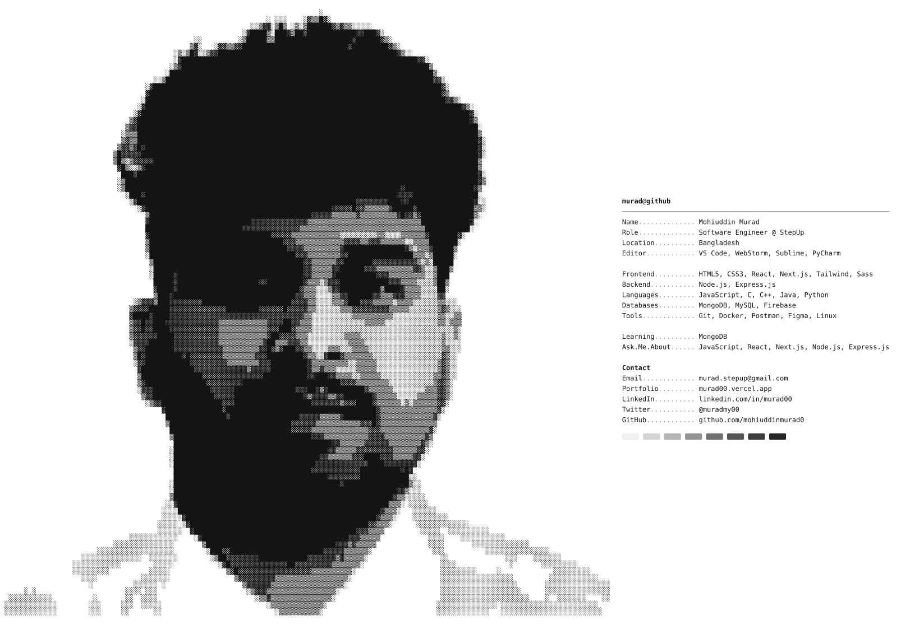

<h1 align="center">
    
</h1>
<h3 align="center">A passionate Software Engineer from Bangladesh</h3>

  <picture>
    <source media="(prefers-color-scheme: dark)" srcset="assets/profile-dark.svg">
    <source media="(prefers-color-scheme: light)" srcset="assets/profile-light.svg">
    
  </picture>

  

---

- 🌱 I’m currently learning **MongoDB**
- 👨‍💻 All of my projects are available at [murad00.vercel.app](https://mohiuddinmurad00.vercel.app)
- 📝 I publish my work live on [Vercel](https://vercel.com/mohiuddin-murads-projects)
- 💬 Ask me about **JavaScript, React, Next.js, Node.js, Express.js**
- 📫 How to reach me **murad.stepup@gmail.com**

<h3 align="left">Connect with me:</h3>

<h3 align="left">Languages and Tools:</h3>

  
   
  

